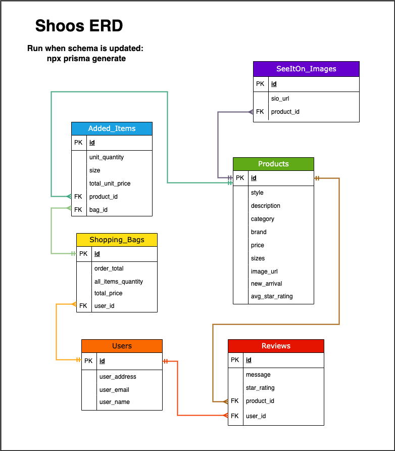
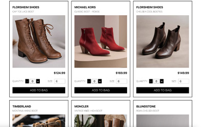
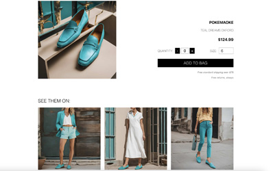
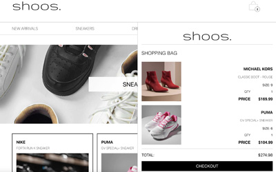
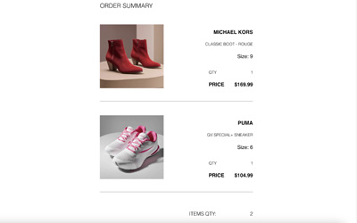

# Shop with us at [Shoos](https://shoos-shop.vercel.app/)!

[Shoos](https://shoos-shop.vercel.app/), an e-commerce site was created as a final group project for the Lighthouse Labs Web Development Bootcamp. Built by [Dan](https://github.com/dcminogue), [Monica](https://github.com/Mpalko07), and [Shanel](https://shanelmadethis.com/).

### Introduction

[Shoos](https://shoos-shop.vercel.app/) is an online shoe store designed to provide a seamless and enjoyable shopping experience for footwear enthusiasts. We offer a diverse range of shoes from top brands, catering to all styles, sizes, and preferences. Our user-friendly platform makes it easy to find the perfect pair of shoes, whether you're looking for the latest fashion trends, sports footwear, or comfortable everyday wear. With a commitment to quality, affordability, and exceptional customer service, [Shoos](https://shoos-shop.vercel.app/) is your go-to destination for all your shoe needs.

##### Features:

- Shop shoe categories
- Select size and quantity and add to shopping bag
- View full product page with AI generated See Them On images.
- Add product reviews from the individual product pages
- View and update shopping cart and checkout
- User, order and review data posted to and retrieved from a [Prisma](https://www.prisma.io/) database
- Deployed to a live site using Vercel [here](https://shoos-shop.vercel.app/)

---

### Database

- Built with [PostgreSQL](https://www.postgresql.org/) and the [Prisma](https://www.prisma.io/) framework.
- Product images were stored on [Vercel Blob](https://vercel.com/docs/storage/vercel-blob) and integrated with the Prisma client.

##### Entity Relationship Diagram for App



---

### Website Quick Look

##### Home Page


##### Gallery Page



##### Product Page



##### Shopping Bag Dropdown



##### Checkout



---

This is a [Next.js](https://nextjs.org/) project bootstrapped with [`create-next-app`](https://github.com/vercel/next.js/tree/canary/packages/create-next-app).

### Getting Started

First, run the development server:

```bash
npm run dev
# or
yarn dev
# or
pnpm dev
# or
bun dev
```

Open [http://localhost:3000](http://localhost:3000) with your browser to see the result.

You can start editing the page by modifying `pages/_app.js`. The page auto-updates as you edit the file.

[API routes](https://nextjs.org/docs/api-routes/introduction) can be accessed on [http://localhost:3000/api/post](http://localhost:3000/api/post).

The `pages/api` directory is mapped to `/api/*`. Files in this directory are treated as [API routes](https://nextjs.org/docs/api-routes/introduction) instead of React pages.

This project uses [`next/font`](https://nextjs.org/docs/basic-features/font-optimization) to automatically optimize and load Gruppo, a custom Google Font.

### Learn More

To learn more about Next.js, take a look at the following resources:

- [Next.js Documentation](https://nextjs.org/docs) - learn about Next.js features and API.
- [Learn Next.js](https://nextjs.org/learn) - an interactive Next.js tutorial.

You can check out [the Next.js GitHub repository](https://github.com/vercel/next.js/) - your feedback and contributions are welcome!

### Deploy on Vercel

The easiest way to deploy your Next.js app is to use the [Vercel Platform](https://vercel.com/new?utm_medium=default-template&filter=next.js&utm_source=create-next-app&utm_campaign=create-next-app-readme) from the creators of Next.js.

Check out our [Next.js deployment documentation](https://nextjs.org/docs/deployment) for more details.
